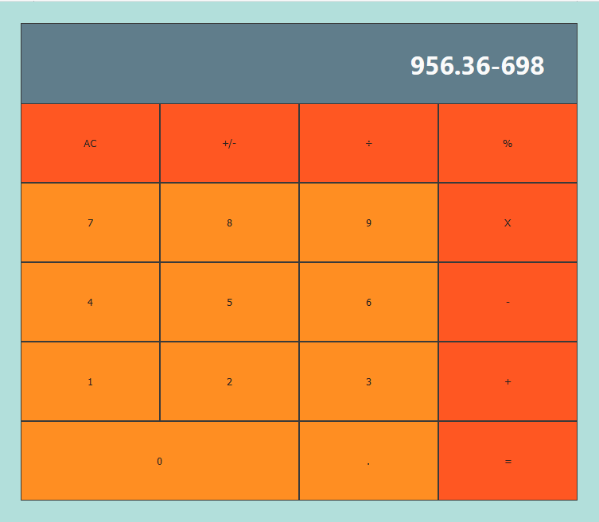

[![Contributors][contributors-shield]][contributors-url]
[![Issues][issues-shield]][issues-url]
 

  <h2 align="center">React Calculator</h2>
  

     
    <a href="https://github.com/Fig77/calculator-react/"><strong>Explore the docs »</strong></a>
     
     
    <a href="https://github.com/Fig77/calculator-react/issues">Report Bug</a>
    ·
    <a href="https://github.com/Fig77/calculator-react/issues">Request Feature</a>
  

<!-- TABLE OF CONTENTS -->

## About The Project

A simple calculator that includes basic algebraic operations. A full list of functions & operations implemented can be seen [here](#functions-implemented). Made with React.

## Table of Contents
- [Built With](#built-with)
- [Installation](#installation)
  - [Prerequisites](#prerequisites)
- [Usage](#usage)
  - [Screenshots](#screenshots)
  - [Live Version](#live-version)
- [Testing](#testing)
- [Future Improvements](#future-improvements)
- [License](#license)
- [Contact](#contact)

<!-- ABOUT THE PROJECT -->

## Built With

* Node.js
* React
* React-DOM
* React-Create-App
* npm
* CSS
* ES6

## Installation

### Prerequisites
- Node
- NPM
- React

---

* Clone the repo with `git clone https://github.com/Fig77/calculator-react.git`, or download as a ZIP.
* Run `npm install`

## Functions implemented

* Simple Algebra functions (+ * / %)
* Sign changer +/-
* Chaining of operations (no brackets, calculating the last one before going to the next one)
* Decimals
* AC to clean everything

Other definitions:

* 0/0 as Undefined
* A/0 as INF
* INF + operation + number as INF

## Usage

* Run `npm start`

By default, the server will start in development on localhost, port 3000.

### Screenshots

### Live Version

- You can view the app hosted online [here](https://calculatordeploy.herokuapp.com).

## Testing

A few tests are in place for logic. To test them:

- Run `npm test` to run the test suites.

<!-- FUTURE IMPROVEMENTS -->

## Future Improvements

* Definition for changing sign of INF.
* Small history display on the side, showing the last few operations.

See the [open issues](https://github.com/Fig77/calculator-react/issues) for a list of proposed features (and known issues).

<!-- LICENSE -->

## License

Distributed under the MIT License. See `LICENSE` for more information.

<!-- CONTACT -->

## Contact📱

- Facundo Iglesias - [Github profile](https://github.com/Fig77)
- Email - fig.igle@gmail.com
- LinkedIn - https://linkedin.com/in/figlesias.com
<!-- MARKDOWN LINKS & IMAGES -->
<!-- https://www.markdownguide.org/basic-syntax/#reference-style-links -->

[contributors-shield]: https://img.shields.io/badge/Contributors-1-%2300ff00
[contributors-url]: https://github.com/Fig77/calculator-react//graphs/contributors
[issues-shield]: https://img.shields.io/badge/issues-0-%2300ff00
[issues-url]: https://github.com/Fig77/calculator-react//issues/
